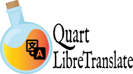

:orphan:

.. title:: Quart LibreTranslate Documentation

Quart LibreTranslate
--------------------

This is a basic extension to use `LibreTranslate`_ in your Quart app
and is based on `AIOHttp`_. LibreTranslate can be ran on the same server
as your Quart app allowing you not needing a third-party provider. 

Reference
---------

.. toctree::
   :maxdepth: 2

   references/index.rst

.. _LibreTranslate: https://github.com/LibreTranslate/LibreTranslate
.. _AIOHttp: https://docs.aiohttp.org/en/stable/
